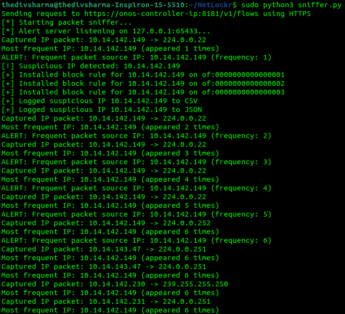

# NetLockr-SDN-Integrated Real-Time Packet Sniffer & Network Security Enhancer

The traditional network monitoring tools like Wireshark we use are powerful but lack programmability.  
In **SDN** environments, administrators require real-time packet monitoring to manage control and understand network parameters and performance to enhance both **performance** and **security**.

**NetLockr** is a network security tool that integrates **ONOS** (Open Network Operating System) with a real-time packet sniffer. It enables dynamic traffic monitoring and security control in SDN environments by extracting key packet information (e.g., IP headers, source/destination addresses) and sending alerts to the SDN controller. Based on these alerts, **ONOS** installs **OpenFlow rules** to block suspicious IPs and enhance network security.

---

## Features

- **Real-time Traffic Monitoring**: Capture and analyze live network traffic.
- **SDN Integration with ONOS**: Alerts from the sniffer are sent to ONOS for automated security responses.
- **Dynamic IP Blocking**: ONOS installs OpenFlow rules to block suspicious IPs.
- **Scalable Security**: Designed for enterprise-level SDN deployments with future enhancements.

---

## NetLockr at Work

<h3>NetLockr at Work</h3>

---

## Architecture

- **Network Simulation**: **Mininet** is used to create the SDN topology.
- **Packet Sniffing**: A **Python socket-based sniffer** captures and analyzes traffic.
- **SDN Controller**: **ONOS** handles security policies and flow control.
- **REST API**: Communication between the sniffer and **ONOS** for real-time alerts and rule installation.
